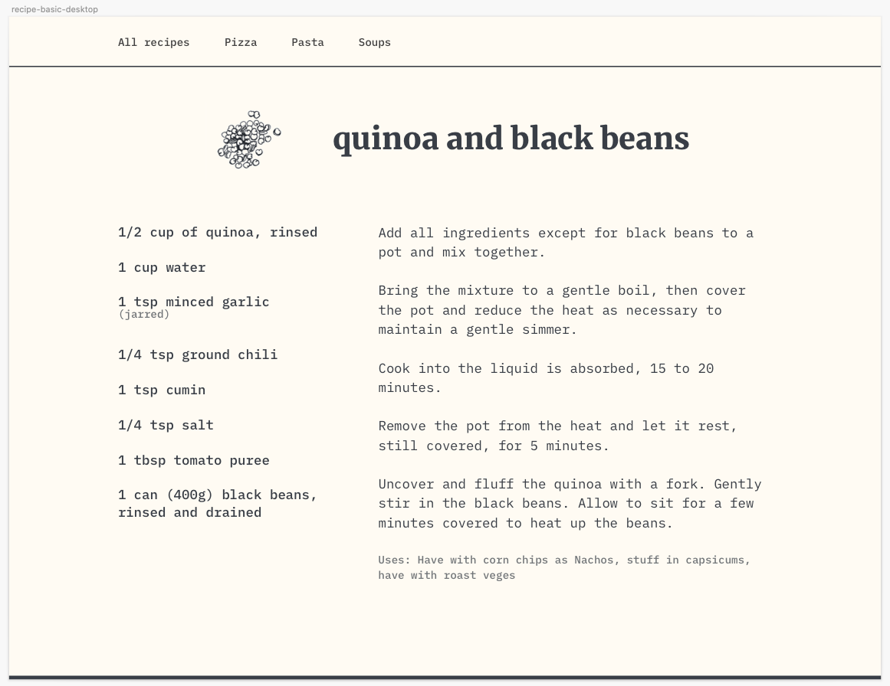

# Instructions:
You've been provided with the following design:

You have `index.html` which is the file for the HTML
For CSS you can use `styles.scss` which will compile any SASS for you but you can also just use normal CSS too don't worry too much about it.

## Variables
- Background color: `#FFFBF3`
- Dark color (fonts/lines): `#393E46`
- Container: `1080px`
- Header font family: `"IBM Plex Mono",monospace`
- Body font family: `"Merriweather",serif`

Recipe contents provided below for ease of copy pasting:

**Menu options:**
- All recipes - Links to `/`
- Pizza - Links to `/pizza`
- Pasta - Links to `/pasta`
- Soups - Links to `/soups`

## quinoa and black beans
**Ingredients:**
- 1/2 cup of quinoa, rinsed

- 1 cup water

- 1 tsp minced garlic (jarred)
- 1/4 tsp ground chili

- 1 tsp cumin

- 1/4 tsp salt

- 1 tbsp tomato puree

- 1 can (400g) black beans, rinsed and drained

**Steps:**
- Add all ingredients except for black beans to a pot and mix together.
- Bring the mixture to a gentle boil, then cover the pot and reduce the heat as necessary to maintain a gentle simmer. 
- Cook into the liquid is absorbed, 15 to 20 minutes.
- Remove the pot from the heat and let it rest, still covered, for 5 minutes. 
- Uncover and fluff the quinoa with a fork. Gently stir in the black beans. Allow to sit for a few minutes covered to heat up the beans.
- Uses: Have with corn chips as Nachos, stuff in capsicums, have with roast veges
